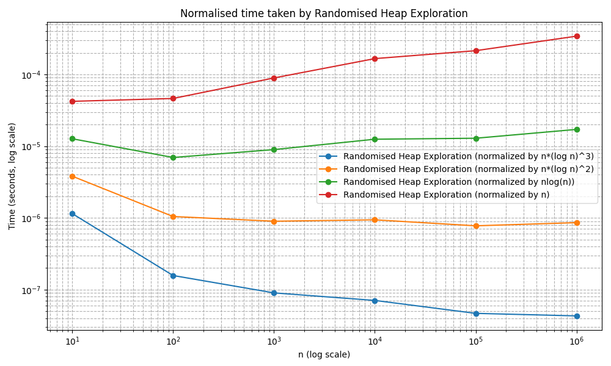
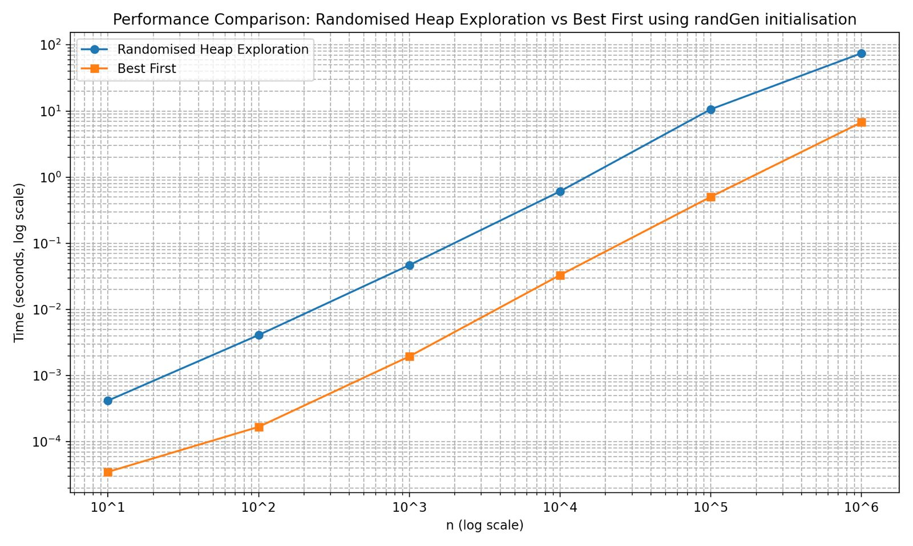
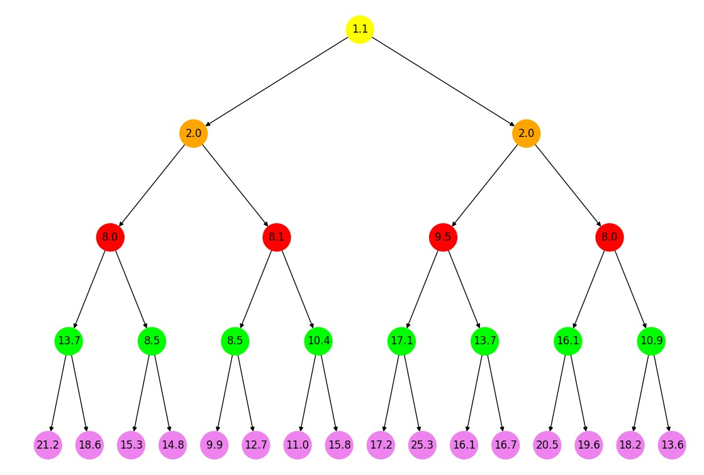
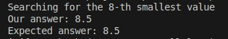

# Explorable-Heap-Selection using Randomised Heap Exploration

An implementation and application of the algorithm from the IPCO 2023 paper "A Nearly Optimal Randomized Algorithm for Explorable Heap Selection."

The algorithm efficiently finds the nth smallest element in an infinitely large binary heap with traversal-based access, achieving an expected time complexity of $O(n \log^3 (n))$ using $O(\log n)$ space.

We implement the algorithm and use it for a branch and bound approach for 0-1 knapsack modelled as an integer linear programming problem.

## Applications

The algorithm is particularly useful for the branch-and-bound optimization method which is often used in integer linear programming. We demonstrate this use in our code.

## How to run

1. Install necessary libraries:

```bash
pip install networkx pulp
```

2. Go into src/ folder

3. To test the base algorithm, write the following in the terminal:

```bash
python3 RandomisedHeapExploration.py
```

4. To test the application for branch and bound optimization on knapsack, write the following in the terminal:

```bash
python3 BranchNBound.py
```

Other uses:

- Run the base algorithm for larger n by modifying the value of n in the file `src/RandomisedHeapExploration.py`

- Visualise the base algorithm for small n (< 10) by setting `visualise=True` in the file `src/RandomisedHeapExploration.py`. THe animation will be saved in the root folder as `heap_animation.mp4`

- Run the branch and bound optimization on a different knapsack problem by changing `data_option = "Small"` in the file `src/BranchNBound.py`

## How to test

1. Go into src/ folder
2. To carry out runtime analysis, write the following in the terminal:

```bash
python3 RuntimeAnalysis.py
```

3. To carry out correctness analysis, write the following in the terminal:

```bash
python3 CorrectnessAnalysis.py
```

## Implementation Details

1. Heap Structure: Implemented as an infinite heap where nodes are generated on access, enforcing parent-first access. Three heap types are supported:
   - firstN: Nodes are integers 1,2,3,…
   - randGen: Nodes are randomly generated while maintaining the heap property
   - knapsack: Nodes represent solutions to knapsack linear programs under constraints
2. Algorithm: Implemented as per reference paper along with core subroutines: Select, Extend, Roots, DFS, and GoodValues.
3. Baseline: BestFirst algorithm used as baseline. Used for verification and runtime comparison. Note that it saves on time by using more memory.
4. Application: The algorithm is used to solve 0-1 Knapsack problem expressed as an integer linear program. Algorithm used to carry out Branch and Bound optimization.
5. Visualization: A visual animation of the algorithm execution is developed: showing node highlights based on the caller of Extend, selected roots, and hiding of "bad" values.

## Code Structure

```
src/
├── baseline/                       # Contains baseline (best first) algo
|    └── BestFirst.py               # Expands from smallest nodes
├── heap/                           # Deals with infinite heap and visualisation
|    ├── Heap.py                    # Heap and Node structure
|    └── NodeValGenerator.py        # Gets node value based on strategy
├── knapsack/                       # Logic for using linear programming in knapsack
|    ├── knapsack_sol.py            # Baseline solver for verification
|    └── LinProbKnap.py             # Uses Linear Programming to solve subproblem
├── subroutines/                    # Contains subroutines of algorithm from paper
|    ├── dfs.py                     # Checks if a values is good or bad
|    ├── goodValues.py              # Random binary search to limit range of (L, U)
|    └── root.py                    # Identifies potential roots to expand from
├── BranchNBound.py                 # Uses branch and bound and algo to solve 0-1 Knapsack
├── CorrectnessAnalysis.py          # Runs many random heap tests to verify correctness
├── RandomisedHeapExploration.py    # The algorithm from the paper
└── RuntimeAnalysis.py              # Tests runtime against baseline, and checks complexity
```

## Time Analysis Plots

We take the ratio of the randomised heap exploration algorithm's run time for different values of n on a randomly generated heap with an expected time complexity. The idea is to find the expected time complexity that causes the ratio to approach a constant value. This would be a good estimate of time complexity for the specific input type. We note that the complexity seems closer to $O(n \log^2 (n))$.
<br> <br>

<br>

We compare the randomised heap exploration algorithm to the baseline algorithm. We note that the former achieves somewhat comparable performance. Note that we expect the former to be slower as it opts for a higher time complexity $O(n \log^2 (n))$ to save on space complexity $O(\log(n))$ as opposed to best first algorithm which has a time complexity of $O(n \log n)$ and a space complexity of $O(n)$.
<br> <br>
 <br>

## Sample Run

Tested on a randomly generated heap for n = 8. We can verify the value (8.5) through the diagram. Note that there are repeat values in the graph that our algorithm stays robust to.
<br> <br>
 <br>


# Original Paper Link

[A Nearly Optimal Randomized Algorithm for Explorable Heap Selection](https://doi.org/10.1007/978-3-031-32726-1_3)
